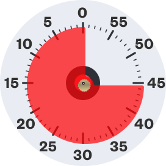

# Google Time Timer

## How to Use

1. **Setting the Timer:**

   - Click and rotate the timer counterclockwise to set the remaining minutes.

2. **Notification Toggle:**

   - Use the notification button to turn on/off notifications for when the timer ends.

## Credits

This project includes design elements that are licensed under the Creative Commons Attribution 4.0 International License (CC BY 4.0). Below is the attribution for the design:

- Design by Mykola Melnyk
  - [Original Work on Figma](https://www.figma.com/community/file/980910147132788911/daily-ui-challenge-014-countdown-timer?searchSessionId=lu7z0fyn-3r4qpnjwgp7)
